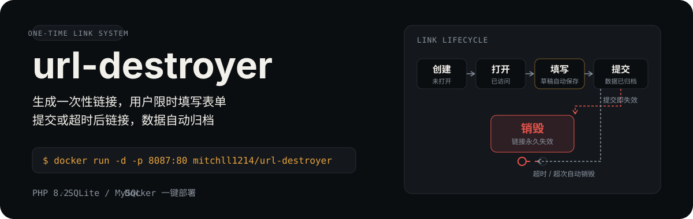

<p align="center">
  
</p>

<p align="center">
  <b>一次性链接销毁系统</b> — 生成限时链接，用户提交或超时后自动失效，数据自动归档。
</p>

<p align="center">
  <a href="https://github.com/Mitchll1214/url-destroyer/blob/main/LICENSE"></a>
  <a href="https://php.net"></a>
  
  
  <a href="https://hub.docker.com/r/mitchll1214/url-destroyer"></a>
</p>

---

## 为什么用它

普通表单链接会被反复打开、转发、爬取。url-destroyer 生成的链接**只用一次**：

- **限时失效** — 首次打开后 N 小时自动过期，也可设置创建后 N 小时未访问即失效
- **一次性** — 可选"提交即失效"，用户提交表单后链接立刻作废
- **防滥用** — 最大访问次数限制，超限自动销毁
- **断点续填** — 用户填写中自动保存草稿，关闭页面重开也能继续
- **数据归档** — 提交内容与访问日志完整留存，可筛选、可导出 CSV

## 🚀 快速开始

### 方式一：Docker 一键部署（推荐）

```bash
docker run -d \
  --name url-destroyer \
  -p 8087:80 \
  -v /opt/url-destroyer/data:/var/www/data \
  -e ADMIN_PASSWORD=my-secret-password \
  mitchll1214/url-destroyer:latest
```

启动后访问：

```
管理后台: http://localhost:8087/admin/
默认密码: admin123（首次登录后请立即修改）
```

> 💡 `-v` 挂载的宿主机目录保存数据库，**更新镜像、删除容器都不会丢数据**。

### 方式二：源码构建

```bash
git clone https://github.com/Mitchll1214/url-destroyer.git
cd url-destroyer
docker compose up -d --build
```

## 📋 使用流程

1. 登录后台 → **创建链接**
2. 填写活动名称、数量、过期策略（可选勾选「提交后立刻失效」）
3. 在可视化构建器设计表单：添加字段、设置标签和默认值，右侧实时预览
4. 点击 **生成链接** → 把 URL 分发给用户

链接会经历 6 种状态：

| 状态 | 含义 |
|------|------|
| 未打开 | 链接已创建，从未被访问 |
| 已打开 | 已访问但未开始填写 |
| 草稿中 | 正在填写，有自动保存数据 |
| 已提交 | 用户已提交表单，等待超时 |
| 已过期 | 超时 / 访问次数达上限 / 提交即失效 |
| 已销毁 | 已过期且超过绝对过期时间，永久失效 |

已过期链接可在后台一键**重新打开**；超过绝对过期时间的链接无法恢复。

## ✨ 功能总览

### 链接管理

| 功能 | 说明 |
|---|---|
| ⏱ 定时销毁 | 首次打开后 N 小时自动失效（默认 24 小时） |
| 🕐 自动过期 | 创建后 N 小时未访问自动失效（默认 7 天） |
| 🔢 批量生成 | 一次创建 1~500 个独立链接 |
| 👁 访问限制 | 最大访问次数，超限自动失效 |
| 🔄 重新打开 | 已过期链接一键恢复 |
| 🔍 搜索筛选 | 状态 + 活动名称 + 日期范围筛选 |
| 📥 CSV 导出 | 按筛选条件导出已提交的表单数据 |

### 表单构建器

| 功能 | 说明 |
|---|---|
| 🎨 可视化编辑 | 拖拽式添加/删除字段，实时预览 |
| 📝 字段类型 | 文本、邮箱、电话、数字、日期、下拉框、多行文本 |
| 💾 草稿自动保存 | 输入停止 1.5 秒自动保存到服务端 |
| 📋 断点续填 | 重开页面自动恢复上次填写内容 |
| 🔄 配置复用 | 从已有链接一键复制表单设计 |
| 📄 HTML 模式 | 自定义 HTML（PHP 标签自动过滤防 RCE） |

### 管理后台

| 功能 | 说明 |
|---|---|
| 📊 仪表盘 | 统计卡片 + 最近链接表格 |
| 📋 链接列表 | 状态筛选、搜索、编辑、删除、一键复制 |
| 📈 访问详情 | 访问日志、提交数据预览、草稿数据预览 |
| ⚙️ 系统设置 | 默认超时、在线修改密码 |
| 🔒 安全加固 | 登录限速（5 次/10 分钟）、CSRF 防护 |
| 🎭 自定义路径 | 修改后台入口 URL 防扫描 |

## 🛠 技术栈

| 层 | 技术 |
|---|---|
| 语言 | PHP 8.2 |
| Web 服务器 | Apache 2.4 + mod_rewrite |
| 数据库 | SQLite 3 (WAL 模式) / MySQL（`DB_DRIVER` 切换） |
| 前端 | 原生 HTML/CSS/JS（零依赖） |
| 容器 | Docker / docker-compose（amd64 + arm64 多架构镜像） |

## ⚙️ 配置

所有配置通过环境变量设置，优先级：**后台设置页 > 环境变量 > 默认值**。

<details>
<summary><b>环境变量参考（点击展开）</b></summary>

### 核心配置

| 变量 | 默认值 | 说明 |
|------|--------|------|
| `ADMIN_PASSWORD` | `admin123` | 管理员初始密码 |
| `DEFAULT_ACCESS_TIMEOUT` | `24` | 首次访问后超时（小时） |
| `DEFAULT_ABSOLUTE_EXPIRY_HOURS` | `168` | 创建后未访问自动过期（小时） |
| `BASE_URL` | 自动检测 | 站点完整 URL（反代/HTTPS 时设置） |
| `ADMIN_PATH` | `admin` | 后台入口路径 |

### 数据库配置

| 变量 | 默认值 | 说明 |
|------|--------|------|
| `DB_DRIVER` | `sqlite` | 驱动：`sqlite`（默认）或 `mysql` |
| `DB_TABLE_PREFIX` | `ud_` | 表名前缀（如 `ud_links`，空字符串取消） |
| `DB_PATH` | `/var/www/data/app.db` | SQLite 数据库文件路径 |
| `DB_HOST` / `DB_PORT` | `127.0.0.1` / `3306` | MySQL 地址与端口 |
| `DB_DATABASE` | `url_destroyer` | MySQL 数据库名 |
| `DB_USERNAME` / `DB_PASSWORD` | `root` / （空） | MySQL 账号密码 |

### 切换 MySQL

```bash
docker run -d \
  --name url-destroyer \
  -p 8087:80 \
  -e DB_DRIVER=mysql \
  -e DB_HOST=mysql.example.com \
  -e DB_DATABASE=url_destroyer \
  -e DB_USERNAME=root \
  -e DB_PASSWORD=your-db-password \
  -e ADMIN_PASSWORD=my-secret-password \
  mitchll1214/url-destroyer:latest
```

> 💡 MySQL 模式下首次启动自动建表（带 `ud_` 前缀），数据存储在外部 MySQL，升级镜像不影响数据。

### 更新镜像

```bash
docker compose pull && docker compose up -d
```

> ⚠️ 不要使用 `docker compose down -v`，`-v` 会删除数据卷。

</details>

## 📊 数据库结构

<details>
<summary><b>表结构参考（点击展开）</b></summary>

> 默认表名前缀 `ud_`，实际表名 = `{DB_TABLE_PREFIX}{表名}`。

### ud_links

| 字段 | 类型 | 说明 |
|---|---|---|
| id | INTEGER | 主键 |
| token | TEXT | 32 位 hex 唯一标识 |
| campaign_name | TEXT | 活动名称 |
| target_content | TEXT | 表单 JSON 或静态 HTML |
| access_timeout | INTEGER | 首次访问后超时（秒） |
| absolute_expiry_hours | INTEGER | 绝对过期（小时） |
| max_accesses | INTEGER | 最大访问次数 |
| access_count | INTEGER | 已访问次数 |
| expire_on_submit | INTEGER | 提交后立刻失效开关 |
| status | TEXT | active / draft / submitted / expired |
| created_at / first_accessed_at / expires_at | TEXT | 创建 / 首次访问 / 过期时间 |

### ud_access_logs

| 字段 | 类型 | 说明 |
|---|---|---|
| id | INTEGER | 主键 |
| link_id | INTEGER | 外键 → ud_links.id |
| ip / user_agent / referer | TEXT | 访问者信息 |
| form_data | TEXT | 提交的表单数据（JSON） |
| accessed_at | TEXT | 访问时间 |

### ud_form_drafts

| 字段 | 类型 | 说明 |
|---|---|---|
| token | TEXT | 链接 Token（主键） |
| form_data | TEXT | 草稿表单数据（JSON） |
| updated_at | TEXT | 最后更新时间 |

### ud_login_attempts

| 字段 | 类型 | 说明 |
|---|---|---|
| id | INTEGER | 主键 |
| ip | TEXT | 尝试登录的 IP |
| attempted_at | TEXT | 尝试时间 |

</details>

## 📁 项目结构

<details>
<summary><b>源码结构（点击展开）</b></summary>

```
url-destroyer/
├── Dockerfile                  # PHP 8.2 + Apache
├── docker-compose.yml          # 端口 8087，data 卷挂载
├── docker-entrypoint.sh        # 启动时数据库检测 + 权限修复
├── data/                       # SQLite 数据库（挂载卷）
├── assets/readme/              # README 视觉素材
└── www/
    ├── config.php              # 全局配置（密码/时区/数据库/URL）
    ├── db.php                  # SQLite / MySQL 双驱动层 + 表前缀
    ├── access.php              # 公开访问入口（核心引擎）
    ├── .htaccess               # URL 重写 + data 目录保护
    └── admin/                  # 管理后台
        ├── index.php           # 仪表盘
        ├── create.php          # 表单构建器 + 链接生成
        ├── links.php           # 链接列表
        ├── stats.php           # 访问详情 + 草稿预览
        ├── settings.php        # 设置 + 在线改密
        └── export.php          # CSV 导出
```

</details>

## 📄 License

MIT © [Mitchll1214](https://github.com/Mitchll1214)
